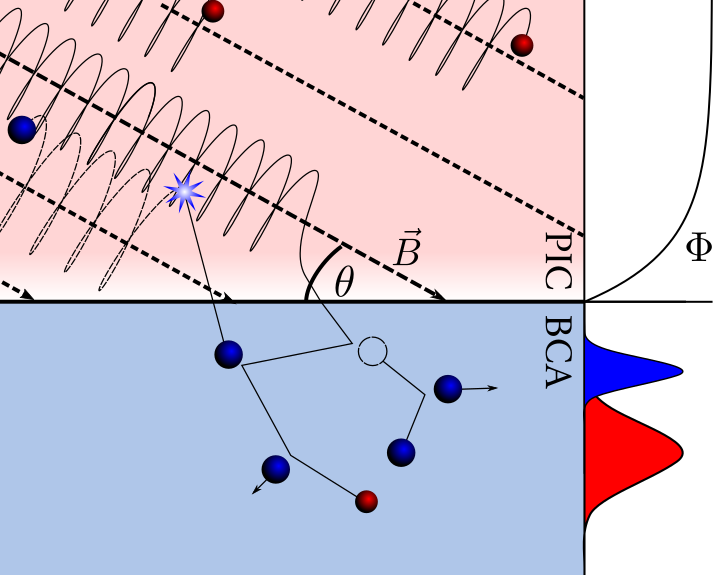

# Research Topics

* Plasma-Material Interactions
* Particle-in-cell Codes
* Binary Collision Approximation Codes
* Fractal Theory
* Scientific Software Development

* * *

# Fluent in:

* Python
* Fortran
* C
* MATLAB

* * *

#Experience with:

* C++
* R
* SAS

> This is a blockquote following a header.
>
> When something is important enough, you do it even if the odds are not in your favor.

### Header 3


```ruby
# Ruby code with syntax highlighting
GitHubPages::Dependencies.gems.each do |gem, version|
  s.add_dependency(gem, "= #{version}")
end
```


