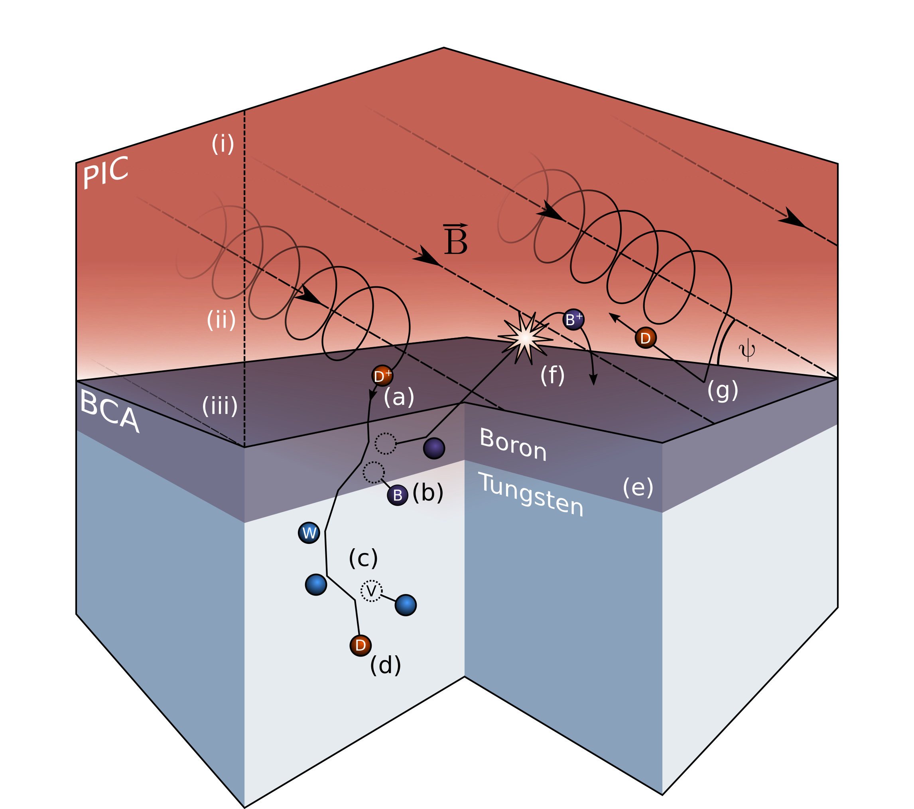
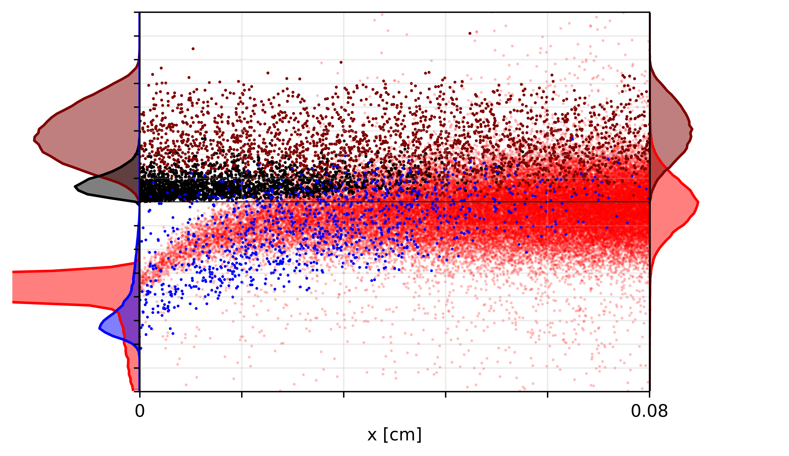
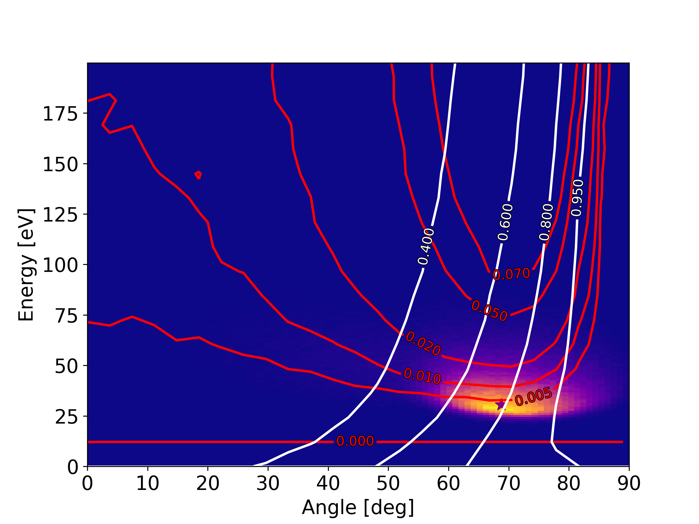

# Research Topics

* Nuclear Fusion
* Plasma-Material Interactions
* Ion-Solid Interactions
* Particle-in-Cell Codes
* Binary Collision Approximation Codes
* Fractal Surface Science
* Interstellar Spaceflight
* Scientific Software Development
* Code Coupling and Integrated Modeling

## Simulating Plasma-Material Interactions

This illustration shows the 3D PIC-BCA physics, including (a) sputtering, (b) ion-driven mixing, (c) vacancy production, (d) implantation, (e) layered composition, (f) ionization and redeposition, (g) reflection as neutrals. Regions of the near-surface plasma are (i) plasma presheath, (ii) magnetic presheath, (iii) Debye sheath.

* * *

## First Author Publications
* [RustBCA: A High-Performance Binary-Collision-Approximation Code for Ion-Material Interactions (JOSS, submitted 2021)] (https://github.com/lcpp-org/RustBCA/blob/master/paper/paper.md)
* * [Damage to Relativistic Interstellar Spacecraft by ISM Impact Gas Accumulation (ApJ, 2021)](https://iopscience.iop.org/article/10.3847/1538-4357/abd4ec)
* [Survivability of Metallic Shields for Relativistic Spacecraft (JBIS, 2020)](https://jbis.org.uk/paper/2020.73.446)
* [F-TRIDYN simulations of tungsten self-sputtering and applications to coupling plasma and material codes (CMS, 2018)](https://doi.org/10.1016/j.commatsci.2018.03.032)
* [F-TRIDYN: A Binary Collision Approximation code for simulating ion interactions with rough surfaces (JNM, 2017)](https://doi.org/10.1016/j.jnucmat.2017.07.037)

## Publications
* [Dependence of the damage in optical metal/dielectric coatings on the energy of ions in irradiation experiments for space qualification (Nature Scientific Reports, 2021)](10.1038/s41598-021-82860-7)
* [Multi-physics modeling of the long-term evolution of helium plasma exposed surfaces (Physica Scripta, 2020)](https://doi.org/10.1088/1402-4896/ab4c29)

## Presenting Author Conference Talks and Posters
* [High-performance PIC-BCA code for fusion-relevant plasma-material interactions (APS-DPP, 2020)](https://meetings.aps.org/Meeting/DPP20/Session/JP19.5) [***pdf***](./APS-DPP_2020_Drobny.pdf)
* [Particle-particle simulations of plasma-material interactions (APS-DPP, 2019)](http://meetings.aps.org/Meeting/DPP19/Session/PO6.11) [***pdf***](./APS-DPP_2019_Drobny.pdf)
* [Comparative Study of Explicit vs. Implicit Particle-in-Cell schemes for Plasma Sheath Simulations (APS-DPP, 2018)](https://meetings.aps.org/Meeting/DPP18/Session/CP11.81) [***pdf***](aps_dpp_pic_drobny_1_JD.pdf)
* [Simulations of divertor target material composition during tokamak plasma operation with continuous boron powder injection (APS-DPP, 2018)](https://meetings.aps.org/Meeting/DPP18/Session/JP11.93) [***pdf***](aps_dpp_boronization_1_JD.pdf)
* [Applied Statistical Model of Surface Morphology for Plasma-Material Interactions (APS-DPP, 2018)](https://meetings.aps.org/Meeting/DPP18/Session/NM9.7) [***pdf***](./APS_DPP_2018_Drobny_Final.pptx.pdf)
* Statistical modeling of surface morphology for multi-scale simulations of plasma-surface interactions (PSI, 2018)
* [Fast, Statistical Model of Surface Roughness for Ion-Solid Interaction Simulations and Efficient Code Coupling (APS-DPP, 2017)](https://meetings.aps.org/Meeting/DPP17/Session/UO4.3)
* [Dynamic Fractal TRIDYN: Modeling Surface Morphology and Composition Evolution under Ion Bombardment (APS-DPP 2016)](https://meetings.aps.org/Meeting/DPP16/Session/JP10.153)
* [Improved Fractal Surface Algorithm for Modeling Evolving Surface Roughness in Dynamic-Composition BCA Codes (APS-DPP, 2015)](https://meetings.aps.org/Meeting/DPP15/Session/PM11.7)
* [Electron-Wave Interaction in a Planar Sputtering Magnetron (Butler University Undergraduate Research Conference, 2014)](https://digitalcommons.butler.edu/urc/2014/physics/5/)
* [Discovering Extrasolar Planets through Hidden Markov Model Analysis (Rose-Hulman Undergraduate Research Publications, 2013)](https://scholar.rose-hulman.edu/cgi/viewcontent.cgi?article=1003&context=undergrad_research_pubs)

* * *

## Miscellany

* Founding member of NPRE Graduate Student Advisory Committee

* Member and regular speaker of the Illinois chapter of [The Hacker Within](http://www.thehackerwithin.org/illinois/). Talks given include:
  - Python 101
  - Esoteric Programming Languages
  - Introduction to the Rust Programming Language
  - [Design and Communication: Scientific Illustration 101](https://docs.google.com/presentation/d/14dvScPZTLxRjnL6SMdTz-P0F8eXSf4sC91d8pyLsgXY/edit?usp=sharing)

* * *

## Programming Languages

### Proficient with:

* Python 2.7, 3.6+
* Fortran 90-95, 2018
* Rust
* C
* MATLAB

### Some Experience with:

* C++, C#
* FORTRAN 77
* R
* GML

* * *

# Further Selected Figures

* * *

## PIC-BCA Coupling Example: Hydrogen on Boron

Coupling of hydrogen plasma to boron wall, plotted in phase space. X-axis is position, Y-axis is velocity of each particle normalized by the thermal speed of that species. Hydrogen ions are shown in red, Hydrogen neutrals reflected from the wall are shownin maroon, sputtered and reflected boron is shown in black, and ionized boron is shown in blue.

## IEADs and Sputtering/Reflection Yields

This figure shows in color the ion energy-angle distribution of deuterium striking a boron wall in a magnetized sheath. Contours in red show the sputtering yield of deuterium on boron, and contours in white show the reflection coefficient. The purple star shows the peak energy and angle of the deuterium IEAD. Using the peak energy and angle significantly underestimates the sputtering yield.
