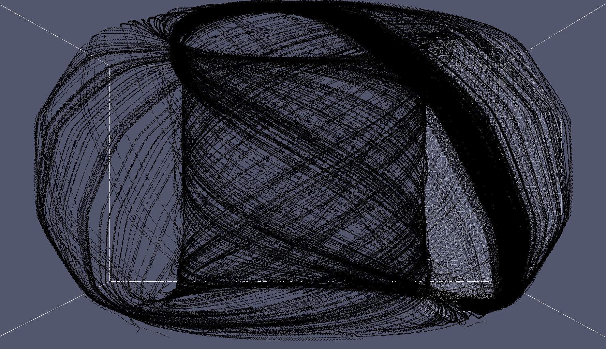
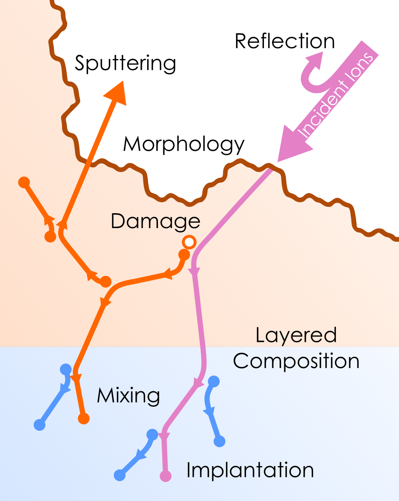

# Research Topics

* Nuclear Fusion
* Plasma-Material Interactions
* Ion-Solid Interactions
* Implicit and Explicit Particle-in-Cell Codes
* Binary Collision Approximation Codes
* Fractal Surface Science
* Interstellar Spaceflight
* Scientific Software Development
* Code Coupling and Integrated Modeling

* * *

## First Author Publications
* Damage to Relativistic Interstellar Spacecraft by ISM Impact Gas Accumulation (ApJ, Submitted 2019)
* [F-TRIDYN simulations of tungsten self-sputtering and applications to coupling plasma and material codes (CMS, 2018)](https://doi.org/10.1016/j.commatsci.2018.03.032)
* [F-TRIDYN: A Binary Collision Approximation code for simulating ion interactions with rough surfaces (JNM, 2017)](https://doi.org/10.1016/j.jnucmat.2017.07.037)

## Publications
* Multi-physics modeling of the long-term evolution of helium plasma exposed surfaces (Physica Scripta, Acceptted 2019)

## Presenting Author Conference Talks and Posters
* [Particle-particle simulations of plasma-material interactions (APS-DPP, upcoming 2019)](http://meetings.aps.org/Meeting/DPP19/Session/PO6.11)
** [pdf](./APS_DPP_2019_Drobny.pdf)
* [Comparative Study of Explicit vs. Implicit Particle-in-Cell schemes for Plasma Sheath Simulations (APS-DPP, 2018)](https://meetings.aps.org/Meeting/DPP18/Session/CP11.81)
* [Simulations of divertor target material composition during tokamak plasma operation with continuous boron powder injection (APS-DPP, 2018)](https://meetings.aps.org/Meeting/DPP18/Session/JP11.93)
* [Applied Statistical Model of Surface Morphology for Plasma-Material Interactions (APS-DPP, 2018)](https://meetings.aps.org/Meeting/DPP18/Session/NM9.7)
** [pdf](./APS_DPP_2018_Drobny_Final.pptx.pdf)
* Statistical modeling of surface morphology for multi-scale simulations of plasma-surface interactions (PSI, 2018)
* [Fast, Statistical Model of Surface Roughness for Ion-Solid Interaction Simulations and Efficient Code Coupling (APS-DPP, 2017)](https://meetings.aps.org/Meeting/DPP17/Session/UO4.3)
* [Dynamic Fractal TRIDYN: Modeling Surface Morphology and Composition Evolution under Ion Bombardment (APS-DPP 2016)](https://meetings.aps.org/Meeting/DPP16/Session/JP10.153)
* [Improved Fractal Surface Algorithm for Modeling Evolving Surface Roughness in Dynamic-Composition BCA Codes (APS-DPP, 2015)](https://meetings.aps.org/Meeting/DPP15/Session/PM11.7)

* * *

## Programming Languages

### Proficient with:

* Python 2.7, 3.6+
* Fortran 90-95, 2018
* C
* MATLAB

### Some Experience with:

* C++, C#
* FORTRAN 77
* R
* Rust
* GML

* * *

## PIC-BCA Coupling

This illustration shows the strategy for coupling particle-in-cell plasma codes to a binary collision approximation material code.

## PIC-BCA Coupling Example: Hydrogen on Boron

Coupling of hydrogen plasma to boron wall, plotted in phase space. X-axis is position, Y-axis is velocity of each particle normalized by the thermal speed of that species. Hydrogen ions are shown in red, Hydrogen neutrals reflected from the wall are shownin maroon, sputtered and reflected boron is shown in black, and ionized boron is shown in blue.

## IEADs and Sputtering/Reflection Yields

This figure shows in color the ion energy-angle distribution of deuterium striking a boron wall in a magnetized sheath. Contours in red show the sputtering yield of deuterium on boron, and contours in white show the reflection coefficient. The purple star shows the peak energy and angle of the deuterium IEAD. Using the peak energy and angle significantly underestimates the sputtering yield.

## Impurity Tracing in Tokamaks

Tracing impurities in DIII-D from DIMES.

## F-TRIDYN Physics

